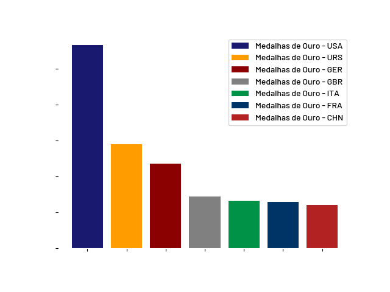
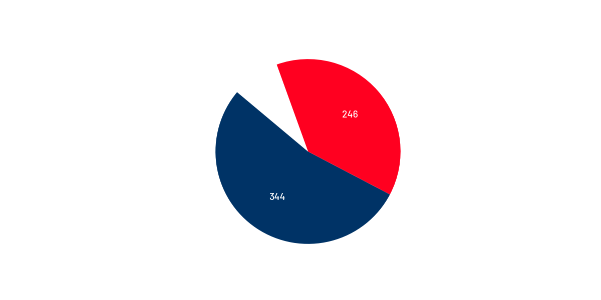
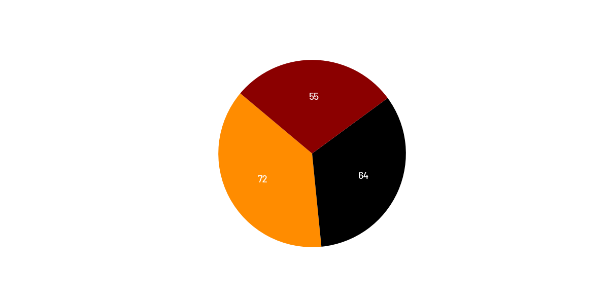
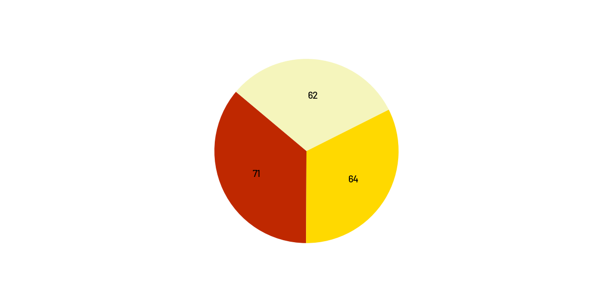
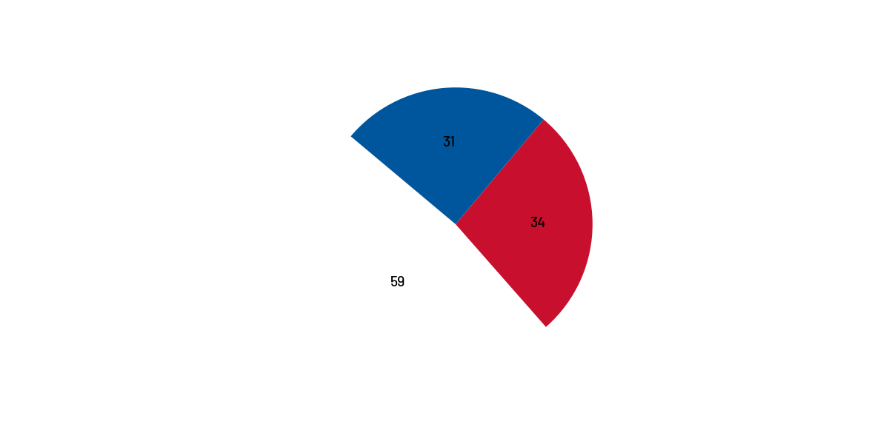
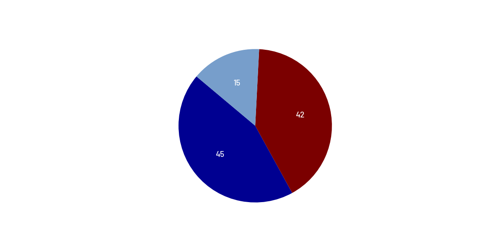
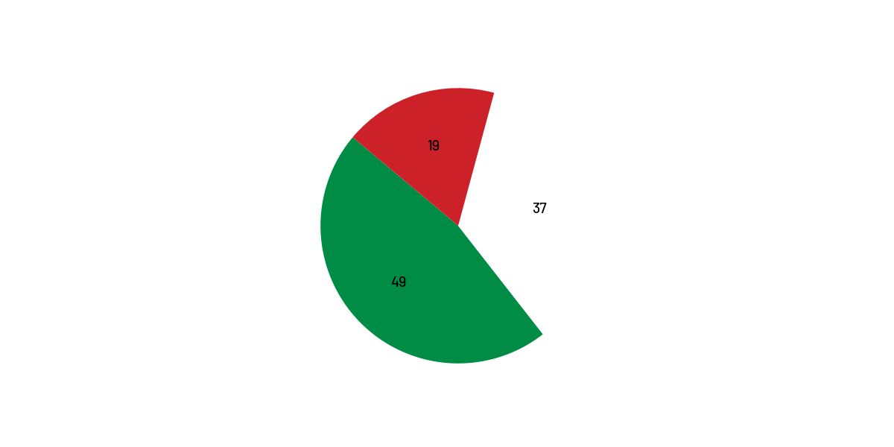
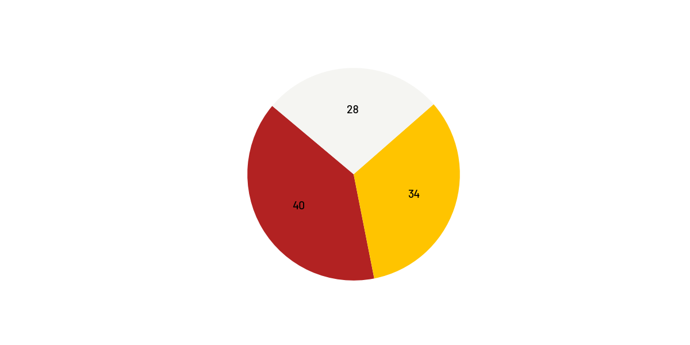

# 🏅 Projeto de Visualização de Medalhas Olímpicas

Este projeto foi desenvolvido para visualizar a distribuição de medalhas de ouro por países ao longo das edições dos Jogos Olímpicos até RIO 2016. O objetivo é utilizar gráficos para representar de forma clara e comparativa o desempenho dos países.

---

## 📊 Visualizações Incluídas

### 📌 Gráfico de Barras Principal
Mostra o total de medalhas de ouro dos principais países:



### 📌 Gráficos Individuais por País

- 🇺🇸 **Estados Unidos (USA)**  
- 🇩🇪 **Alemanha (GER)**  
- 🇷🇺 **União Soviética (URS)** 
- 🇬🇧 **Reino Unido (GBR)**  
- 🇫🇷 **França (FRA)** 
- 🇮🇹 **Itália (ITA)**  
- 🇨🇳 **China (CHN)**  

Cada país possui um gráfico individual que mostra sua participação ao longo do tempo.

| País  | Gráfico |
|-------|---------|
| Estados Unidos|  |
| Alemanha |  |
| União Soviética |  |
| Reino Unido |  |
| França |  |
| Italia |  |
| China |  |


---

## 🛠️ Ferramentas Utilizadas

- `Python 3.x`
- `Jupyter Notebook`
- `Matplotlib`
- `Pandas`

---

## 🖌️ Estilo

- Fonte utilizada: **Barlow-Medium.ttf** (inclusa no repositório)
- Cores distintas para cada país (inclusas no repositório na aba **Style**)
- Estilo limpo e moderno para facilitar a leitura

---

## 🚀 Como Executar

1. Clone o repositório:
```bash
git clone https://github.com/seu-usuario/olympics-visualization.git
cd olympics-visualization
```

2. Instale os pacotes necessários:
```bash
pip install matplotlib pandas
```

3. Abra o notebook Jupyter:
```bash
jupyter notebook ativinfograph.ipynb
```

---

## 📂 Arquivos

| Arquivo | Descrição |
|--------|-----------|
| `ativinfograph.ipynb` | Notebook principal com os gráficos |
| `main_graph.png` | Gráfico principal de medalhas |
| `chn-graph.png`, `fra-graph.png`, etc. | Gráficos individuais por país |
| `Barlow-Medium.ttf` | Fonte personalizada usada nos gráficos |

---

## 📌 Licença

Este projeto é educacional, sem fins comerciais, com base em dados públicos obtidos através do [Kaggle](https://www.kaggle.com/datasets/heesoo37/120-years-of-olympic-history-athletes-and-results)

---

## ✍️ Autor

Desenvolvido por Matheus Amorim
💼 GitHub: [https://github.com/MatheusAmorimm](https://github.com/MatheusAmorimm)
